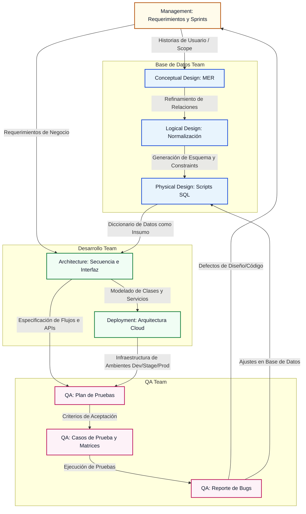

# 🚴 UrbanCycling-Documentation

🛡️ **Repositorio Central de Ingeniería y Ciclo de Vida del Proyecto**  
*Single Source of Truth (SSoT) para el ecosistema de movilidad urbana sostenible.*

## 📌 Introducción y Propósito Del Ecosistema

### Propósito de este Repositorio
Este repositorio puramente documental centraliza la **Ingeniería del Ciclo de Vida del Software** de Urban Cycling. Actúa como el núcleo de conocimiento técnico que alinea los esfuerzos del equipo de datos, desarrollo, control de calidad y gestión académica. Aquí se consolidan desde los modelos relacionales de datos hasta las estrategias de despliegue en la nube, garantizando que el diseño del sistema sea rastreable, reproducible y mantenible.

---

## 🗺️ Índice de Contenidos

- [📂 Estructura del Repositorio (Mapeo de Carpetas)](#-estructura-del-repositorio-mapeo-de-carpetas)
- [📊 Flujo de Trabajo e Integración Interdisciplinaria](#-flujo-de-trabajo-e-integración-interdisciplinaria)
- [🔍 Desglose Técnico de Módulos](#-desglose-técnico-de-módulos)
  - [🗄️ 01. Database Team (Equipo de Base de Datos)](#-01-database-team-equipo-de-base-de-datos)
  - [💻 02. Development Team (Equipo de Desarrollo)](#-02-development-team-equipo-de-desarrollo)
  - [🧪 03. QA Team (Equipo de Control de Calidad)](#-03-qa-team-equipo-de-control-de-calidad)
  - [📚 Project Management & Docs (Gestión del Proyecto)](#-project-management--docs-gestión-del-proyecto)
- [🛠️ Stack de Herramientas de Documentación](#-stack-de-herramientas-de-documentación)
- [🤝 Estándares de Contribución y Buenas Prácticas](#-estándares-de-contribución-y-buenas-prácticas)
- [📝 Licencia e Integridad Académica](#-licencia-e-integridad-académica)

---

## 📂 Estructura del Repositorio (Mapeo de Carpetas)

A continuación se detalla la estructura jerárquica del repositorio. Cada carpeta contiene componentes clave que describen el estado de diseño, validación y planificación de la plataforma.

```text
📂 UrbanCycling-Documentation (Raíz)
 ├── 📂 01_Database_Team
 │    ├── 📂 Conceptual_Design
 │    │    └── 📄 Modelos Entidad-Relación y diagramas conceptuales
 │    ├── 📂 Logical_Design
 │    │    └── 📄 Diagramas lógicos y normalización de datos (1FN, 2FN, 3FN)
 │    └── 📂 Physical_Design
 │         └── 📄 Diagramas físicos, diccionarios de datos y scripts DDL/DML (.sql)
 ├── 📂 02_Development_Team
 │    ├── 📂 Architecture_&_Design
 │    │    ├── 📂 Component_Diagrams
 │    │    └── 📂 Sequence_Diagrams
 │    └── 📂 Deployment
 │         └── 📄 Diagramas de despliegue en nube (SaaS), topología e infraestructura como código (IaC)
 ├── 📂 03_QA_Team
 │    ├── 📂 Test_Plans
 │    │    └── 📄 Estrategia de pruebas, alcances, riesgos y criterios de aceptación (Go/No-Go)
 │    ├── 📂 Test_Cases
 │    │    └── 📄 Matriz de trazabilidad y casos de prueba detallados (funcionales y no funcionales)
 │    └── 📂 Bug_Reports
 │         └── 📄 Registro, severidad, reproducibilidad y ciclo de vida de defectos
 └── 📂 Project_Management_&_Docs
      ├── 📂 Management
      │    └── 📄 Actas de reuniones, product backlogs, objetivos de Sprints e informes de KPIs
      └── 📂 Academic_Reports
           └── 📄 Entregables formales de ingeniería, informes de cátedra y presentaciones
```

---

## 📊 Flujo de Trabajo e Integración Interdisciplinaria

La documentación no es aislada; los artefactos técnicos generados por cada subequipo alimentan a los demás de forma secuencial y cíclica. El siguiente diagrama conceptual en **Mermaid.js** ilustra cómo la salida de un equipo actúa como entrada fundamental del siguiente:



---

## 🔍 Desglose Técnico de Módulos

A continuación se presenta un análisis exhaustivo del contenido, la justificación y los entregables correspondientes a cada área de especialización técnica:

### 🗄️ 01. Database Team (Equipo de Base de Datos)
El almacenamiento y la persistencia de datos georreferenciados exigen un riguroso proceso de modelado para evitar la redundancia, garantizar la integridad referencial y asegurar una latencia de respuesta óptima ante consultas masivas de rutas GPS.

| Subdirectorio | Entregable Clave | Valor Técnico e Impacto |
| :--- | :--- | :--- |
| `Conceptual_Design` | Diagrama Entidad-Relación (DER) extendido. | Mapea la abstracción de las entidades del negocio (Usuarios, Ciclovías, Sensores, Historial de Rutas) sin atarse a un motor de base de datos específico. Define la semántica de datos. |
| `Logical_Design` | Diagrama Relacional Normalizado y justificación de formas normales (1FN, 2FN, 3FN). | Traduce el DER a un esquema relacional optimizado. Previene anomalías de inserción, actualización y borrado mediante la normalización de entidades críticas como la telemetría de viajes. |
| `Physical_Design` | Scripts `.sql` estructurados (DDL y DML inicial), diccionario de datos completo e índices espaciales definidos. | Implementa la base de datos física (PostgreSQL/PostGIS o SQL Server). Define los tipos de datos exactos, restricciones (`FOREIGN KEY`, `CHECK`), índices de rendimiento y configuraciones geográficas. |

---

### 💻 02. Development Team (Equipo de Desarrollo)
Esta sección detalla los planos estructurales y de comportamiento del software, permitiendo a los ingenieros de software construir componentes modulares desacoplados y configurar ambientes de ejecución escalables y tolerantes a fallos.

| Subdirectorio | Entregable Clave | Valor Técnico e Impacto |
| :--- | :--- | :--- |
| `Architecture_&_Design` | Diagramas de Secuencia (UML), Diagramas de Componentes (UML) y diagramación de flujos asíncronos. | Describe las interacciones de bajo nivel entre los controladores, la capa de servicios (APIs) y los repositorios de persistencia. Permite entender de un vistazo la lógica de negocio detrás de transacciones críticas como la sincronización de una ruta. |
| `Deployment` | Diagrama de Despliegue en la nube, topología de red virtual (VPC) y configuraciones Docker Compose / Kubernetes. | Modela la arquitectura en infraestructura de nube (AWS, Azure o GCP). Muestra la distribución de cargas usando balanceadores de tráfico, firewalls, almacenamiento de objetos e integración con servicios de mensajería (colas/tópicos). |

---

### 🧪 03. QA Team (Equipo de Control de Calidad)
El equipo de aseguramiento de la calidad certifica que el software cumple con los altos estándares de seguridad, usabilidad y rendimiento requeridos para operar en el sector público y privado de transporte multimodal.

| Subdirectorio | Entregable Clave | Valor Técnico e Impacto |
| :--- | :--- | :--- |
| `Test_Plans` | Documento del Plan de Pruebas (Estrategia, Criterios de Aceptación, Tipos de Pruebas). | Define el alcance del testing (funcional, de carga, de seguridad) y los criterios objetivos para dictaminar si un entregable de software está listo para producción (criterios *Go / No-Go*). |
| `Test_Cases` | Matriz de Trazabilidad y detalle paso a paso de los casos de prueba (entradas, pasos y resultados esperados). | Proporciona un conjunto de pruebas repetibles y automatizables que mapean de extremo a extremo los requerimientos funcionales declarados por negocio. |
| `Bug_Reports` | Bitácora formal de fallos reportados con severidad (Crítica, Mayor, Menor), pasos de reproducción y logs adjuntos. | Permite catalogar los incidentes detectados en fase de pruebas, monitoreando el ciclo de vida del bug (Abierto, En Progreso, Resuelto, Verificado) para mitigar riesgos antes del despliegue. |

---

### 📚 Project Management & Docs (Gestión del Proyecto)
Este módulo actúa como el hilo conductor metodológico y académico, proporcionando visibilidad a las partes interesadas (stakeholders) sobre la velocidad del equipo, los hitos alcanzados y los sustentos teóricos del proyecto.

| Subdirectorio | Entregable Clave | Valor Técnico e Impacto |
| :--- | :--- | :--- |
| `Management` | Minutas de Reunión, Sprint Backlogs refinados, Diagramas de Gantt y retrospectivas. | Documenta la agilidad del proyecto utilizando Scrum/Kanban. Almacena las decisiones de diseño del producto y los compromisos adquiridos en cada sprint para mantener al equipo sincronizado. |
| `Academic_Reports` | Monografías de Ingeniería, Informes de Avance Semestrales y Presentaciones Ejecutivas. | Consolida la producción académica formal de la universidad. Contiene marcos conceptuales, estudios de viabilidad financiera y arquitectónica para fines de evaluación institucional. |

---

## 🤝 Estándares de Contribución y Buenas Prácticas

Todos los integrantes de los subequipos tienen la responsabilidad de proteger la calidad del repositorio de documentación. Siga estas directrices estrictas al realizar aportes:

### 1. Convención de Nomenclatura de Archivos
*   Utilice siempre la nomenclatura **CamelCase** o **snake_case** en minúsculas para nombrar archivos físicos de diseño.
*   Evite caracteres especiales, tildes o espacios (use guiones bajos `_` en su lugar).
*   **Ejemplo Correcto**: `01_Database_Team/Physical_Design/2026_05_27_db_physical_schema.sql`
*   **Ejemplo Incorrecto**: `01_Database_Team/Physical_Design/Script Base de datos Final final.sql`

### 2. Formato de Documentos de Texto
*   Toda especificación funcional o reporte técnico intermedio debe redactarse usando sintaxis estándar de GitHub Flavored Markdown (GFM).
*   Si el documento supera las 3 páginas, debe incluir una **Tabla de Contenidos interactiva** al inicio.
*   Los scripts SQL deben tener cabeceras documentadas con el autor, fecha de creación, propósito general y versión del motor compatible.

### 3. Flujo de Git para Documentación
1.  **Nunca** haga commit directamente a la rama `main`.
2.  Cree una rama descriptiva de su subequipo y el documento a actualizar:
    ```bash
    git checkout -b doc/db-physical-design
    ```
3.  Agregue y confirme sus cambios con mensajes semánticos de Git:
    ```bash
    git commit -m "docs(db): add spatial indices physical script for Route tracking"
    ```
4.  Cree un *Pull Request (PR)* en GitHub y etiquete al menos a un líder de otro subequipo para revisión cruzada antes del merge.

---

## 📝 Licencia e Integridad Académica

Este repositorio y todo su material adjunto son propiedad del equipo de estudiantes de la asignatura **Ingeniería de Software I (ISW I)** del **Semestre 7**.
Su uso está estrictamente regulado para fines académicos. Queda prohibida la reproducción parcial o total del diseño de arquitectura para fines comerciales sin la debida autorización de los autores.

---

> 🚴 **Urban Cycling: Moviendo negocios legacy hacia el futuro, línea de código a línea de código.**
